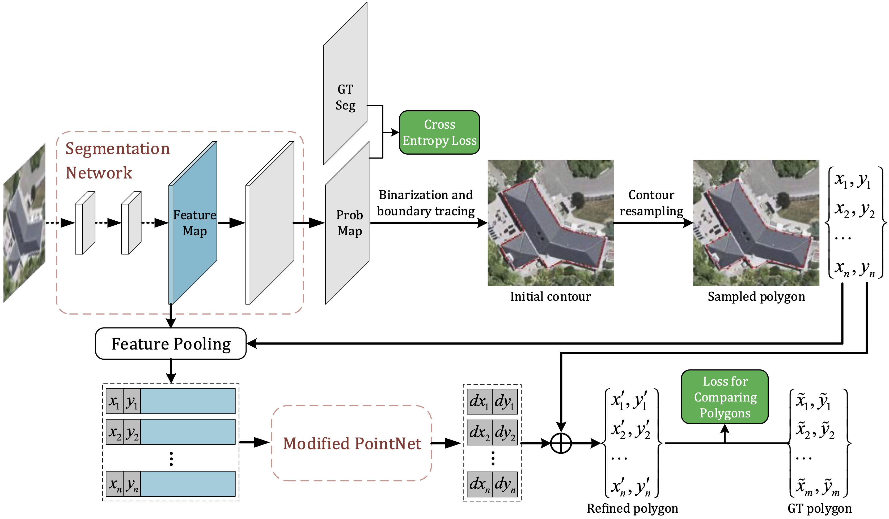
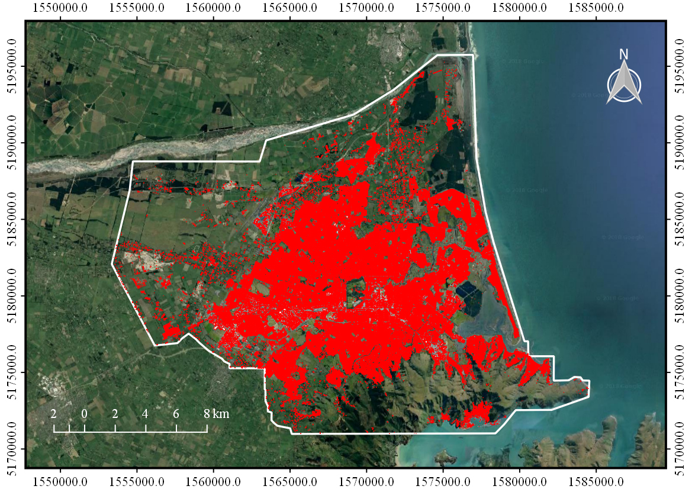
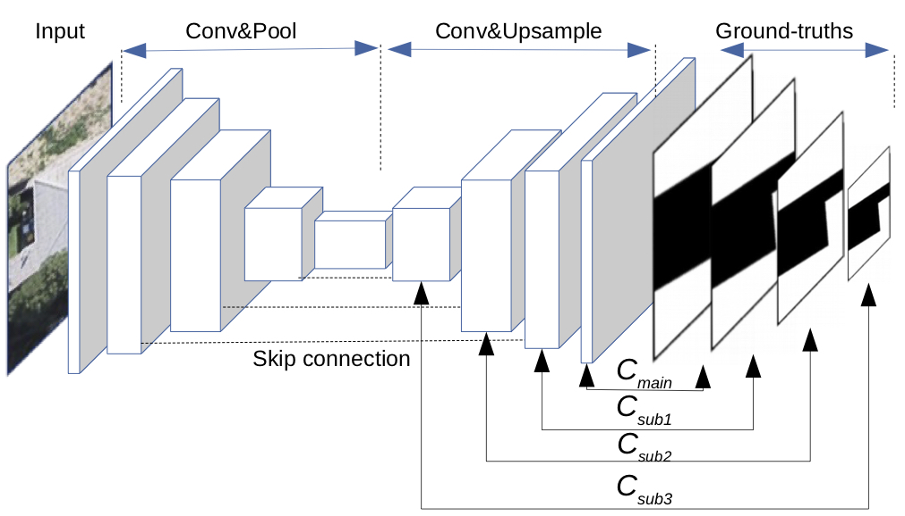
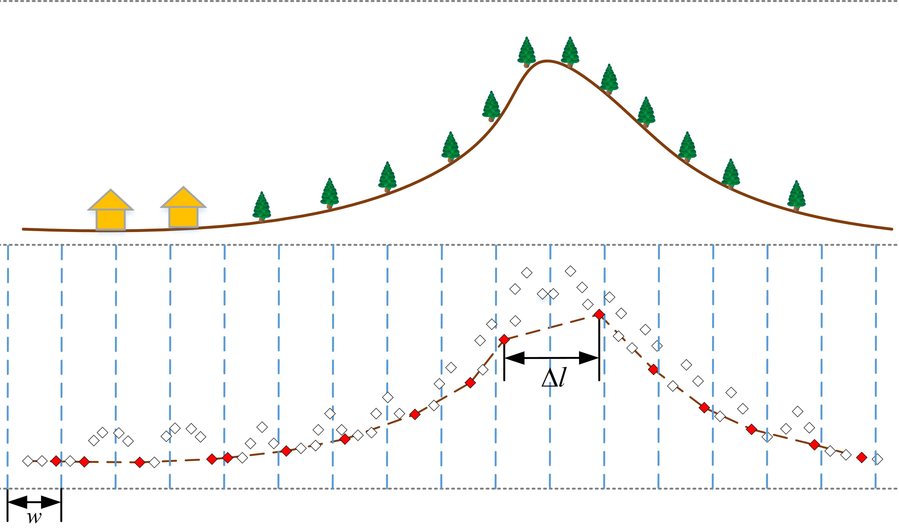
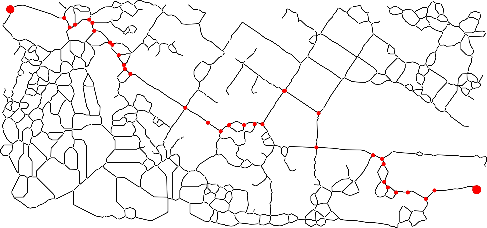
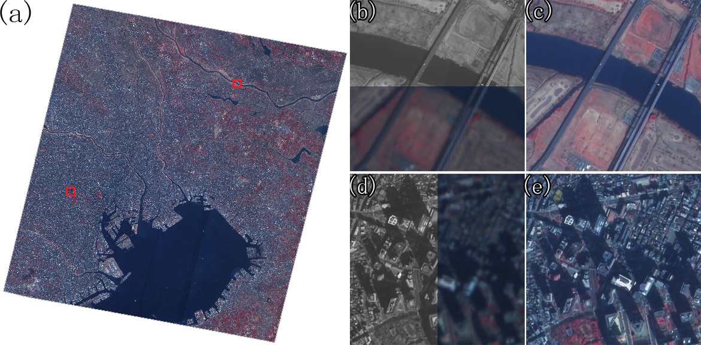

### 主要科研项目

主持中央高校基本科研业务费专项基金项目：不同期高分遥感影像与建筑物轮廓数据的自动配准方法研究(CUG190603)，2019.1-2021.12  

主持并完成国家自然科学基金青年科学基金项目：联合机载LiDAR与航空影像的建筑物自适应检测及其精细轮廓提取(41601506)，2017.1-2019.12  

主持并完成中国博士后科学基金面上项目(一等资助)：联合机载LiDAR与航空影像的建筑物精细轮廓提取(2016M590730)，2016.1-2017.12

### 主要研究成果
#### 1. 一种用于建筑物矢量生成的形状建模学习框架

{:width="62%"}  
提出了一种用于遥感影像建筑物矢量生成的形状建模深度学习框架(PolygonCNN)，该框架将建筑物矢量生成问题划分为建筑物分割和轮廓形状优化两个步骤：首先采用全卷积形式的图像分割模型从遥感影像生成建筑物目标概率图，并经由二值化、聚类和边缘轮廓跟踪处理生成建筑物初始矢量轮廓；然后将初始轮廓节点坐标序列与对应位置的图像特征进行级联并输入至一个改进的PointNet模型中进行形状先验知识的特征编码，输出矢量轮廓各节点的坐标校正值，最终生成优化后的建筑物矢量结果。（[PDF](../assets/img/achievements/polygonCNN.pdf)）

#### 2. 构建大规模航空影像建筑物检测数据集与基准方法

{:width="62%"}  
构建并发布了一组0.075米分辨率、覆盖范围457平方公里、包含建筑物目标22万余个的航空影像数据集(Aerial Imagery for Roof Segmentation, AIRS)用于建筑物检测试验。在此基础上，实现了三种代表当时先进水平的CNN模型方案作为基准方法，并对不同方法的检测结果进行了详细比较分析。AIRS数据集可由[此处](https://www.airs-dataset.com/)获取。（[PDF](../assets/img/achievements/airs.pdf)）

#### 3. 基于多重约束全卷积网络的航空影像建筑物检测

{:width="62%"}  
针对经典卷积神经网络结构在前向传播过程中分辨率不断下降，导致仅采用末层特征时难以实现建筑物边缘的精确分割，进而限制目标检测精度的问题，提出一种基于多重约束的全卷积网络(Multi-Constraint Fully Convolutional Network, MCFCN)。试验结果表明，基于MCFCN模型的检测结果优于其改进对象U-Net模型，显著优于FCN模型和基于人工设计特征的AdaBoost模型。（[PDF](../assets/img/achievements/mcfcn.pdf)）

#### 4. 面向城市与陡坡混合区域的点云滤波方法

{:width="62%"}  
针对传统点云滤波方法难以同时适应一般城市地形和山区陡坡地形的问题，提出一种改进的渐近三角网加密算法用于对城市与陡坡混合区域点云数据进行滤波以生成高精度DTM，其主要改进策略在于通过提取山脊点和曲面拟合等方式对加密三角网的初始种子点进行优化选择，从而达到增强算法对不同地形适应能力的目的。试验表明，本方法可自适应地在居民区和山区两类地形上同时取得优秀的滤波效果。（[PDF](../assets/img/achievements/filter.pdf)）

#### 5. DSM辅助下的城市正射影像镶嵌线网络自动生成方法

{:width="62%"}  
首次将影像高程同步模型(Orthoimage Elevation Synchronous Model, OESM)用于正射影像镶嵌，避免了投影差导致的正射影像与DSM数据中地物高度不同步问题对影像镶嵌精度的影响。（[PDF](../assets/img/achievements/mosaic.pdf)）

#### 6. 用于ZY-1-02C卫星数据融合的影像自动配准方法

{:width="62%"}  
针对ZY-1-02C卫星全色影像与多光谱影像定位精度偏差较大的问题，提出一种由粗到精的同名点匹配方法，并应用基于同名三角网的小面元纠正方法得到高精度配准结果。该配准方法已应用于ZY-1-02C卫星融合影像产品的业务化生产系统。（[PDF](../assets/img/achievements/registration.pdf)）
