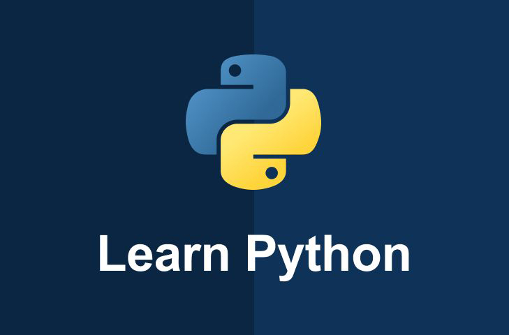
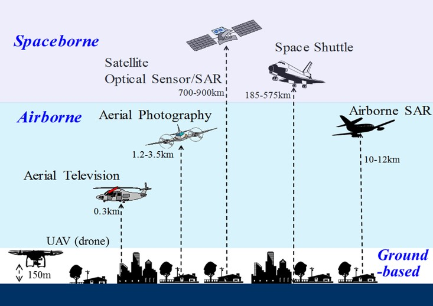

### **本科生课程**
#### 《计算科学基础》

{:width="62%"}  
面向大一新生，以简单易学的Python高级编程语言为载体讲授计算科学基础知识。

#### 《模式识别》

{:width="62%"}  
面向大二下本科生，讲授统计模式识别的基本理论和技术方法的入门知识。

### **研究生课程**
#### 《专业英语》

{:width="62%"}  
面向硕士研究生，讲授遥感领域专业英语阅读和写作方面的相关知识。
